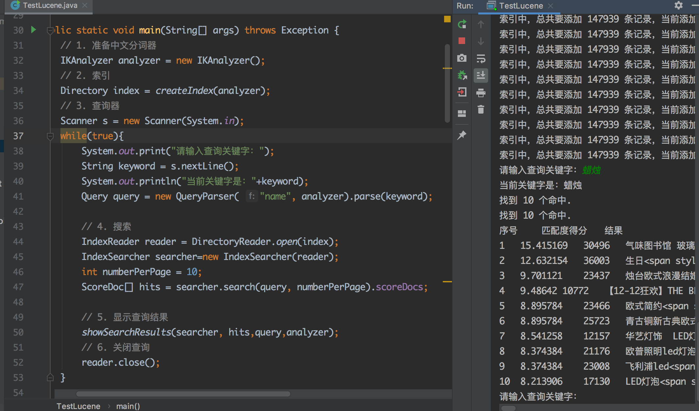

## 海量数据处理搜索系统项目_周报告1

[TOC]

### 1.Lucene的应用

应用Lucene7.7，模仿博客的代码，在后台建立搜索系统，实现对14万条产品数据的搜索功能。

其中，数据保存在.txt文件中，数据样式较规整，一件产品不同维度的信息以逗号隔开，示例如下：

`10001,房屋卫士自流平美缝剂瓷砖地砖专用双组份真瓷胶防水填缝剂镏金色,品质建材,398.00,上海,540785126782`

#### 实现效果：

在控制台console中输入关键字，比如“蜡烛”，系统按照产品的"name"域搜索，选出匹配度最高的前十款产品，排序显示：



### 2.代码分析

#### 2.1.创建索引

14万条产品数据信息，信息从该文件中读取。

下面代码创建了索引writer，将产品的信息存入索引writer。

```java
public class TestLucene {

	public static void main(String[] args) throws Exception {
        ...
		// 创建索引
		Directory index = createIndex(analyzer);
        ...
        }
	}
    ...
}
```

```java
	private static Directory createIndex(IKAnalyzer analyzer) throws IOException {
        Directory index = new RAMDirectory();
		IndexWriterConfig config = new IndexWriterConfig(analyzer);
		IndexWriter writer = new IndexWriter(index, config); // 创建索引writer
		String fileName = "140k_products.txt";
		List<Product> products = ProductUtil.file2list(fileName); // 读入产品信息，返回products列表，元素为产品类
		int total = products.size();
		int count = 0;
		int per = 0;
		int oldPer =0;
		for (Product p : products) { // 将products列表的元素制作成索引；每一个产品信息作为一个文件
			addDoc(writer, p);
			count++;
			per = count*100/total;
			if(per!=oldPer){
				oldPer = per;
				System.out.printf("索引中，总共要添加 %d 条记录，当前添加进度是： %d%% %n",total,per);
			}
			
		}
		writer.close();
		return index;
	}
```

细看如下addDoc函数：每传入一个产品数据，就为该产品创建一个Document，为Document创建6个域"id"、"name"、"category"、"price"、"place"、"code"。

函数最后，将该产品的Document放入索引中。

```java
	private static void addDoc(IndexWriter w, Product p) throws IOException {
		Document doc = new Document(); //
		doc.add(new TextField("id", String.valueOf(p.getId()), Field.Store.YES));
		doc.add(new TextField("name", p.getName(), Field.Store.YES));
		doc.add(new TextField("category", p.getCategory(), Field.Store.YES));
		doc.add(new TextField("price", String.valueOf(p.getPrice()), Field.Store.YES));
		doc.add(new TextField("place", p.getPlace(), Field.Store.YES));
		doc.add(new TextField("code", p.getCode(), Field.Store.YES));
		w.addDocument(doc);
	}
```

#### 2.2.创建查询器

下面的代码创建了查询器，接收从控制台输入的关键字，依据索引的"name"字段查询。

```java
public class TestLucene {

	public static void main(String[] args) throws Exception {
        ...
        // 查询器
        Scanner s = new Scanner(System.in);
        while(true){
        	System.out.print("请输入查询关键字：");
            String keyword = s.nextLine();
            System.out.println("当前关键字是："+keyword);
    		Query query = new QueryParser( "name", analyzer).parse(keyword);
        ...
        }
	}
    ...
}
```

#### 2.3.执行搜索

执行搜索，见如下代码注释：
```java
public class TestLucene {

	public static void main(String[] args) throws Exception {
        ...
        // 搜索
			// 创建索引reader
    		IndexReader reader = DirectoryReader.open(index);
    		// 基于reader创建搜索器
    		IndexSearcher searcher=new IndexSearcher(reader);
    		// 指定每页要显示多少条数据
    		int numberPerPage = 10;
    		// 执行搜索
    		ScoreDoc[] hits = searcher.search(query, numberPerPage).scoreDocs;
        }
	}
    ...
}
```

#### 2.4.显示查询结果

显示查询结果涉及对搜索结果的排序，内容封装在`showSearchResults()`函数中，将在后面的学习中进一步学习。
```java
public class TestLucene {

	public static void main(String[] args) throws Exception {
        ...
        // 显示查询结果
			showSearchResults(searcher, hits,query,analyzer);
        }
	}
    ...
}
```

#### 2.5.完整代码

```java
public class TestLucene {

	public static void main(String[] args) throws Exception {
		// 1. 准备中文分词器
		IKAnalyzer analyzer = new IKAnalyzer();
		// 2. 索引
		Directory index = createIndex(analyzer);
		// 3. 查询器
        Scanner s = new Scanner(System.in);
        while(true){
        	System.out.print("请输入查询关键字：");
            String keyword = s.nextLine();
            System.out.println("当前关键字是："+keyword);
    		Query query = new QueryParser( "name", analyzer).parse(keyword);

    		// 4. 搜索
			// 创建索引reader
    		IndexReader reader = DirectoryReader.open(index);
    		// 基于reader创建搜索器
    		IndexSearcher searcher=new IndexSearcher(reader);
    		// 指定每页要显示多少条数据
    		int numberPerPage = 10;
    		// 执行搜索
    		ScoreDoc[] hits = searcher.search(query, numberPerPage).scoreDocs;
    		
    		// 5. 显示查询结果
    		showSearchResults(searcher, hits,query,analyzer);
    		// 6. 关闭查询
    		reader.close();
        }
	}

	private static void showSearchResults(IndexSearcher searcher, ScoreDoc[] hits, Query query, IKAnalyzer analyzer) throws Exception {
		System.out.println("找到 " + hits.length + " 个命中.");

        SimpleHTMLFormatter simpleHTMLFormatter = new SimpleHTMLFormatter("<span style='color:red'>", "</span>");
        Highlighter highlighter = new Highlighter(simpleHTMLFormatter, new QueryScorer(query));

        System.out.println("找到 " + hits.length + " 个命中.");
        System.out.println("序号\t匹配度得分\t结果");
		for (int i = 0; i < hits.length; ++i) {
			ScoreDoc scoreDoc= hits[i];
			int docId = scoreDoc.doc;
			Document d = searcher.doc(docId);
			List<IndexableField> fields= d.getFields();
			System.out.print((i + 1) );
			System.out.print("\t" + scoreDoc.score);
			for (IndexableField f : fields) {
				if("name".equals(f.name())){
		            TokenStream tokenStream = analyzer.tokenStream(f.name(), new StringReader(d.get(f.name())));
		            String fieldContent = highlighter.getBestFragment(tokenStream, d.get(f.name()));
					System.out.print("\t"+fieldContent);
				}
				else{
					System.out.print("\t"+d.get(f.name()));
				}
			}
			System.out.println("<br>");
		}
	}

	private static Directory createIndex(IKAnalyzer analyzer) throws IOException {
		Directory index = new RAMDirectory();
		IndexWriterConfig config = new IndexWriterConfig(analyzer);
		IndexWriter writer = new IndexWriter(index, config);
		String fileName = "140k_products.txt";
		List<Product> products = ProductUtil.file2list(fileName); // 读入产品信息，返回列表，元素为产品类
		int total = products.size();
		int count = 0;
		int per = 0;
		int oldPer =0;
		for (Product p : products) { //
			addDoc(writer, p);
			count++;
			per = count*100/total;
			if(per!=oldPer){
				oldPer = per;
				System.out.printf("索引中，总共要添加 %d 条记录，当前添加进度是： %d%% %n",total,per);
			}
			
		}
		writer.close();
		return index;
	}

	private static void addDoc(IndexWriter w, Product p) throws IOException {
		Document doc = new Document(); //
		doc.add(new TextField("id", String.valueOf(p.getId()), Field.Store.YES));
		doc.add(new TextField("name", p.getName(), Field.Store.YES));
		doc.add(new TextField("category", p.getCategory(), Field.Store.YES));
		doc.add(new TextField("price", String.valueOf(p.getPrice()), Field.Store.YES));
		doc.add(new TextField("place", p.getPlace(), Field.Store.YES));
		doc.add(new TextField("code", p.getCode(), Field.Store.YES));
		w.addDocument(doc);
	}
}

```


### 3.参考内容

[1] [参考博客1](https://how2j.cn/k/search-engine/search-engine-14k/1674.html) 